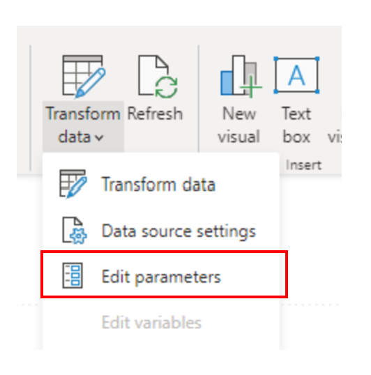
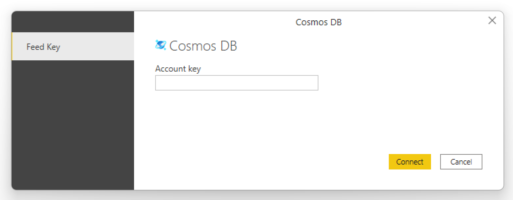
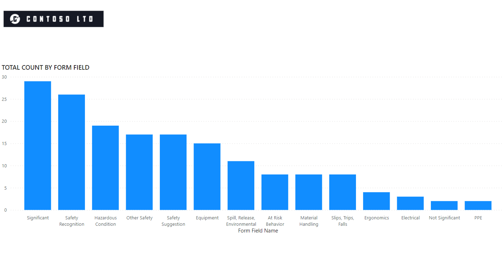
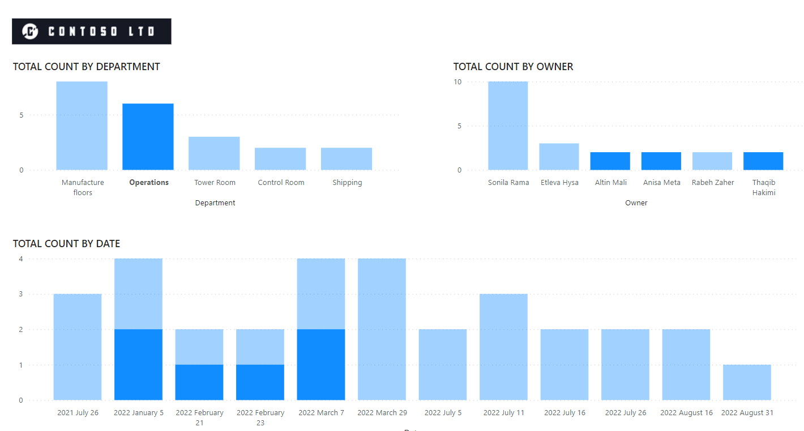

# Set up Power BI Model

## Connect Power BI to your Azure Cosmos DB

1. In the Azure Portal, locate your Azure Cosmos DB. From left panel, under `Settings`, click `Keys`, you will see the URI of your Cosmos DB, and account keys. Copy this for later use.

1. Open the [Power BI Desktop file](./Safety-Form-Report.pbix) in this directory.

1. From the `Transform data` drop down menu, click `Edit Parameters`, as illustrated below: 

   

1. Fill in the Cosmos DB URI you saved previously, as illustrated below, and click Ok.

   

1. Power BI will prompt you to apply change, as illustrated below. Click `Apply changes`.

   

1. Power BI will prompt you to enter Cosmos DB Account Key, as illustrated below. Enter your Cosmos DB Account key you saved previously and then click `Connect`. After this, you should see a similar dashboard shown in the [solution accelerator overview](../../README.md).

   

## Included Power BI Reports
The  Power BI report below shows the number of forms submitted by category. The category is the field key defined by the Azure AI Document Intelligence.

The report below shows the number of safety forms submitted by department, by owner, and by date.

