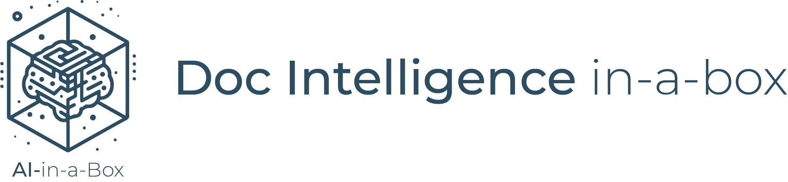
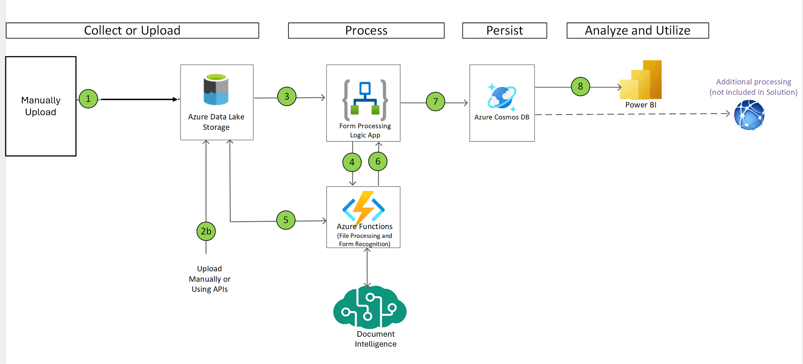
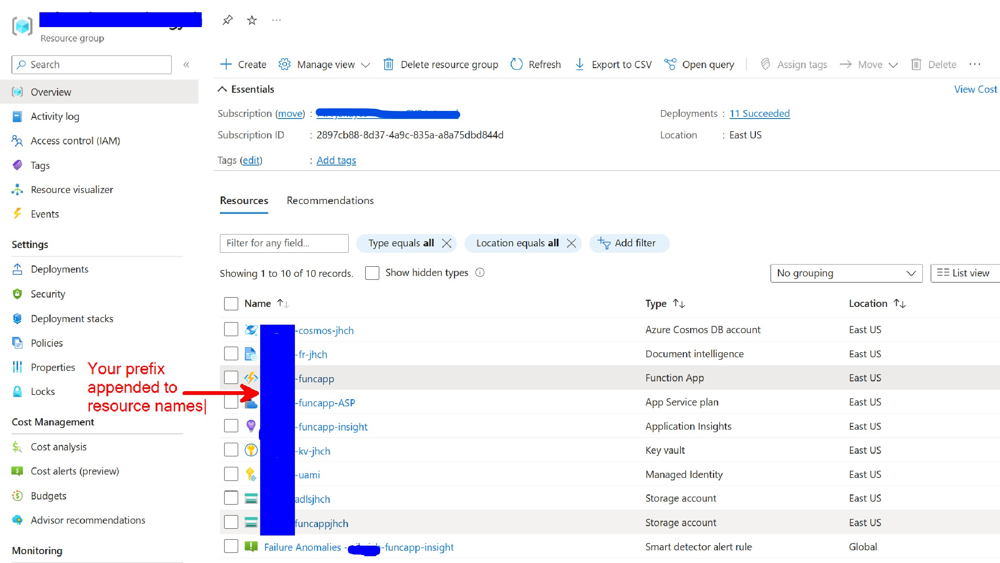

<<<<<<< HEAD
# AI-in-a-Box Document Intelligence-in-a-Box
=======
# Doc-Intelligence-in-a-Box

>>>>>>> 359c6be46309fb717eda07211d83c2f4d962fe90

<!-- 

  

    This solution is part of the the AI-in-a-Box framework developed by the team of Microsoft Customer Engineers and Architects to accelerate the deployment of AI and ML solutions. Our goal is to simplify the adoption of AI technologies by providing ready-to-use accelerators that ensure quality, efficiency, and rapid deployment.
  

  

    
  

 -->
|||
|:---| ---:|
|This solution is part of the the AI-in-a-Box framework developed by the team of Microsoft Customer Engineers and Architects to accelerate the deployment of AI and ML solutions. Our goal is to simplify the adoption of AI technologies by providing ready-to-use accelerators that ensure quality, efficiency, and rapid deployment.|  |

## User Story

Azure AI Document Intelligence empowers organizations to automate form processing. Azure AI Document Intelligence offers:

- **Automation**: Streamlines the data extraction process from various forms, reducing the need for manual data entry.
- **Accuracy**: Enhances data accuracy by minimizing human errors during data extraction.
- **Efficiency**: Saves time and resources by quickly processing large volumes of documents.
- **Scalability**: Easily handles increasing amounts of data as your organization grows.
- **Integration**: Seamlessly integrates with existing databases and systems for smooth data management.
- **Security**: Ensures that extracted data is securely stored and accessible only to authorized personnel.
- **Versatility**: Works with different types of documents, including handwritten and digital forms.
- **User-Friendly**: Provides an intuitive interface for reviewing and correcting any flagged data.

Here's a few ways different industries can leverage Azure AI Document Intelligence:

- **Healthcare**: Extract patient information from medical forms to streamline record-keeping and improve patient care.
- **Finance**: Automate the extraction of data from financial documents like invoices and receipts for accurate accounting.
- **Legal**: Digitize and organize information from legal documents to enhance case management and research.
- **Retail**: Process customer feedback forms and surveys to gain insights and improve service.
- **Education**: Extract data from student enrollment forms to maintain accurate and up-to-date records.
- **Manufacturing**: Automate the extraction of data from inspection and quality control forms to ensure compliance.
- **Insurance**: Process claims forms quickly and accurately to expedite claim settlements.
- **Government**: Digitize and organize information from various forms to improve public service efficiency.

## What's in the Box

The solution leverages [Azure AI Document Intelligence](https://azure.microsoft.com/en-us/products/ai-services/ai-document-intelligence) to extract data from PDF forms and store the data in a [Azure Cosmos DB](https://learn.microsoft.com/en-us/azure/cosmos-db/introduction).

1. PDF forms are loaded to a container in [Azure Data Lake Storage Gen2](https://learn.microsoft.com/en-us/azure/storage/blobs/data-lake-storage-introduction) (ADLS Gen2).
2. When the PDFs are loaded to the container, an [Azure Logic App](https://learn.microsoft.com/en-us/azure/logic-apps/logic-apps-overview) is triggered to start the processing of the PDF form(s).  
3. The Logic App sends the PDF file location to an [Azure Functions app](https://learn.microsoft.com/en-us/azure/azure-functions/functions-overview?pivots=programming-language-python) for processing.
4. The Azure Functions app receives the location of file and performs the following:

    1. Splits the file into single pages if the file has multiple pages, with each page containing one independent form and saves them to an ADLS Gen2.
    2. Sends the location of the single page PDF file to Azure AI Document Intelligence for processing via a REST API (HTTPS POST)and receives response.
    3. Prepares the response into the desired data structure.
    4. Saves the structured data as a JSON file to another ADLS Gen2 container.

5. The Logic App receives the processed response data from the Azure Functions app and sends the processed data to Azure Cosmos DB.
6. The data is saved in the Azure Cosmos DB collections.
7. [Power BI](https://learn.microsoft.com/power-bi/fundamentals/power-bi-overview) is connected to the Azure Cosmos DB to extract data and provide insights.

The solution includes the following:

- Bicep modules which deploy the following Azure resources:
  
- Instructions for creating, training and deploying the Azure AI Document Intelligence model
- A Power BI Desktop file with reports over the data extracted from the forms and into the Azure Cosmos DB

## Thinking Outside of the Box

This solution can easily be modified out of the box with your own PDF forms. This solution includes a labeled dataset generated from PDF files to illustrate the concept. To use the solution with your own forms, create your own labeled datasets, [follow this guide on generating labeled datasets](https://learn.microsoft.com/en-us/azure/ai-services/document-intelligence/concept-custom-label?view=doc-intel-4.0.0). Then train a new model using Azure AI Document Intelligence, as described later.

## Deploy the Solution

### Prerequisites for running locally

1. Latest version of [Azure CLI](https://docs.microsoft.com/en-us/cli/azure/tall-azure-cli-windows?view=azure-cli-latest)
2. Latest version of [Bicep](https://docs.microsoft.com/en-us/azure/azure-resource-manager/ep/install)
3. Latest version of [Azure Developer CLI](https://learn.microsoft.com/en-us/azure/developer/re-developer-cli/install-azd)
4. Latest version [Azure Functions Core Tools](https://docs.microsoft.com/en-us/azure/re-functions/functions-run-local?\tabs=v4%2Cwindows%2Ccsharp%2Cportal%2Cbash#v2)

### Deploy to Azure

1. Clone this repo:

    `git clone https://github.com/Azure-Samples/gpt-video-analysis-in-a-box`
2. Deploy resources:

   `azd auth login`

   `azd up`

### Post Deployment

After your Azure Resources are deployed, you will upload the sample forms to you Azure Storage account and create a Custom Extraction model in Document Intelligence Studio.

[Follow the steps here](docs\machine-learning-instructions.md). Then continue on to run the solution.

## Run the Solution

Now you have a solution that will receive extract data from PDF forms and store the data in a Azure Cosmos DB whenever a PDF form is landed in the ADLS Gen2 container. In most cases, you would have some other application that would land the forms in ADLS (such as Azure Data Factory, a feature or app to extract forms from emails, another applications that sends forms to the storage account, etc.). For testing the solution, we will manually upload the files into the ADLS container. [Follow the steps here](docs\)

## Customize the Solution

This solution deploys the infrastructure needed for processing form data and loading the data into a database. After deploying the solution in your Azure subscription and testing the solution as described, you can extend the solution to work with you own files and data.

### Automate loading files to blob storage

When testing the solution, you will manually upload PDF files to blob storage. For you own environment, you may wish to automate uploading the files to blob storage. There's a host of options to automate the uploading of files, including Azure Data Factory, Azure Logic Apps, Azure Functions, and Power Automate.

### Use the Azure Data Platform of your choice

This Azure Logic app in this solution loads data into Azure Cosmos DB. You can change the Logic App connection to load the into your  preferred Azure Data Platform, including Azure SQL DB, Azure SQL DB or Azure Data Lake Gen2.

### Convert to batch

Change the Logic App to process files in batch instead of when files are added or integrate the form processing app into your own app

### Customize to support other file types

Custom models support other file types as well as PDFs. [Read here to see what file types are currently supported](https://learn.microsoft.com/en-us/azure/ai-services/document-intelligence/concept-custom?view=doc-intel-4.0.0#input-requirements)

### Use Custom Neural Template for form variations

At times, forms may vary in some ways with regards to the form layout. In these cases, where the data extracted is similar but the forms are not exactly the same, a [customer neural template](https://learn.microsoft.com/en-us/azure/ai-services/document-intelligence/concept-custom-neural?view=doc-intel-4.0.0) may provide better results that a custom template model. Create a custom neural template and test to see if it out-performs the custom template model.

### Create a Power BI semantic model and report

[Follow the instructions here to create a Power BI semantic model and report.](./docs/powerbi.md)

## How to Contribute

This project welcomes contributions and suggestions. Most contributions require you to agree to a Contributor License Agreement (CLA) declaring that you have the right to, and actually do, grant us the rights to use your contribution. For details, visit <https://cla.opensource.microsoft.com>

When you submit a pull request, a CLA bot will automatically determine whether you need to provide a CLA and decorate the PR appropriately (e.g., status check, comment). Simply follow the instructions provided by the bot. You will only need to do this once across all repos using our CLA.

This project has adopted the [Microsoft Open Source Code of Conduct](https://opensource.microsoft.com/codeofconduct/). For more information see the [Code of Conduct FAQ](https://opensource.microsoft.com/codeofconduct/faq) or contact <opencode@microsoft.com> with any additional questions or comments.
## Key Contacts & Contributors

Highlight the main contacts for the project and acknowledge contributors. You can adapt the structure from AI-in-a-Box:

| Contact | GitHub ID | Email |
|---------|-----------|-------|
| Jean Hayes | @jehayesms | <jean.hayes@microsoft.com> |
| Chris Ayers |@@codebytes | <chrisayers@microsoft.com> |

## Acknowledgments

If applicable, offer thanks to individuals, organizations, or projects that helped inspire or support your project.

## License

This project may contain trademarks or logos for projects, products, or services. Authorized use of Microsoft trademarks or logos is subject to and must follow [Microsoft's Trademark & Brand Guidelines](https://www.microsoft.com/en-us/legal/intellectualproperty/trademarks/usage/general). Use of Microsoft trademarks or logos in modified versions of this project must not cause confusion or imply Microsoft sponsorship. Any use of third-party trademarks or logos are subject to those third-party's policies.

---

This project is part of the AI-in-a-Box series, aimed at providing the technical community with tools and accelerators to implement AI/ML solutions efficiently and effectively.
