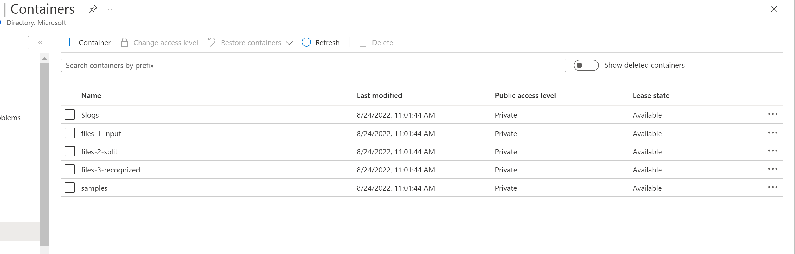
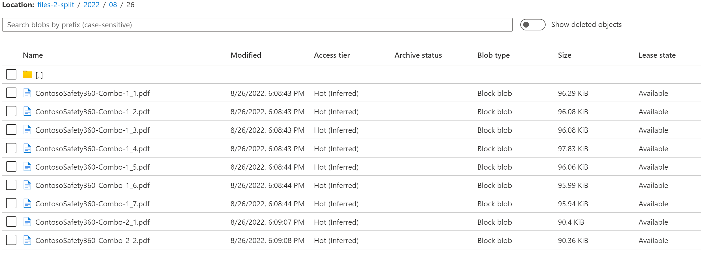
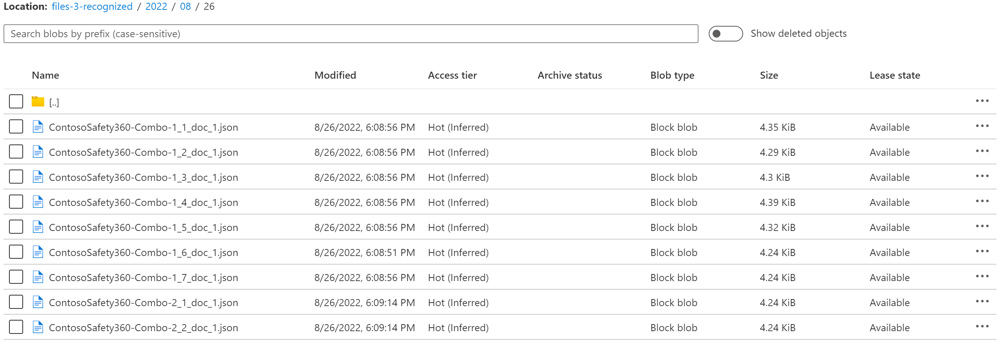
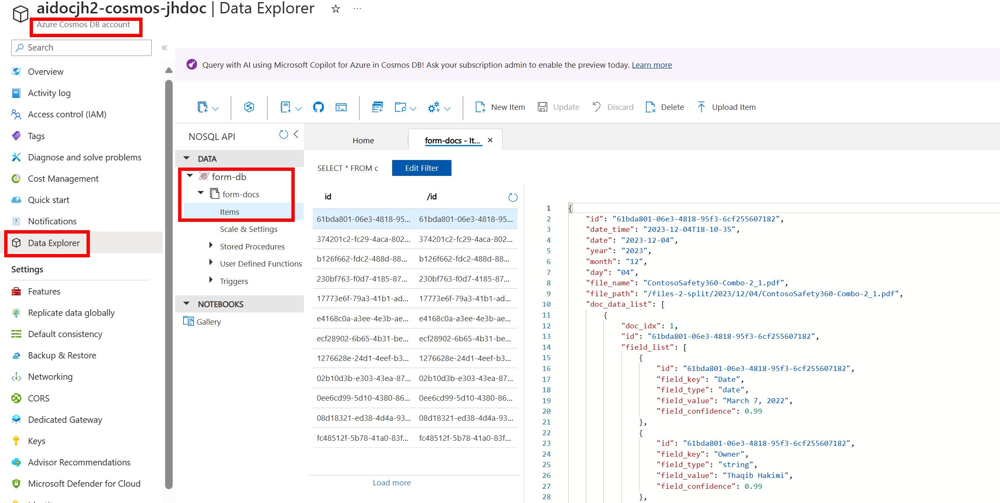

# Run the Solution

Once you have have successfully deployed and configured the solution as required, follow the instructions below to test the solution.

## Step 1: Upload PDFs to Azure Data Lake Storage Containers

1. Go to the [Azure Portal](https://portal.azure.com) and select the Azure Storage Account that contains the samples folder.
1. Click the resource and get to its overview page.
1. In the menu pane on the left, under `Data storage`, select `Containers`. You should see containers listed as below:

    

1. Navigate to the `file-1-input` folder  and upload selected files from [``..data/samples/test/contoso_set_1/``](../data/samples/test/contoso_set_1/) to `file-1-input`.

## Step 2: Verify the Form Processing Logic App

1. From Azure portal, open the Form Processing Logic App interface and click 'Run'.
1. Examine azure storage container `files-2-split`. If successful, you should see results similar to the screen below:

   

1. Examine azure storage container `files-3-recognized`. If successful, you should see results similar to the screen below:

    

## Step 3: Verify that the Cosmos Database received the data

1. From the Azure portal, go to the Azure Cosmos Database account that was deployed through this solution.
1. On the left panel, click `Data Explorer`. You will see a NoSQL database called `form-db` with a table called `form-docs`.
1. Expand `form-docs` and you will see `Items`.
1. Click on `Items` to see the form data that was extracted from the PDFs.

[Now go back to see how you can customize the solution](../README.md#optional---create-a-power-bi-semantic-model-and-report-to-view-the-results)